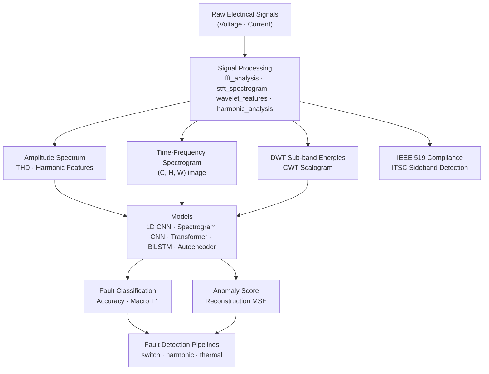

# AI Power Electronics Diagnostics

<div align="center">


**AI-based fault detection in industrial power electronics systems from electrical signals.**

*Inverter Diagnostics · Motor Drive Fault Detection · Signal Processing · Harmonic Analysis*

</div>

---

## Overview

Industrial power electronics systems — inverters, motor drives, and converters — are critical components in manufacturing, renewable energy, and transportation. Their failure causes costly unplanned downtime. This repository provides a complete AI pipeline for **early fault detection from electrical signals** (voltage waveforms, current signals, harmonic spectrum) — targeting engineers and researchers in the IEEE Industrial Electronics Society community.

The framework covers:

- Physics-informed synthetic signal generation (no download required to get started)
- Signal processing pipeline: FFT, STFT spectrograms, wavelet decomposition, harmonic analysis
- 5 deep learning model architectures for fault classification and anomaly detection
- End-to-end fault detection pipelines for switching faults, harmonic distortions, and thermal anomalies
- Benchmarks on both synthetic and real Kaggle motor temperature data

| Domain | Fault Types | Signals |
|--------|-------------|---------|
| **3-Phase VSI Inverter** | Open-circuit IGBT (T1–T6), Short-circuit, DC undervoltage | Va, Vb, Vc, Ia, Ib, Ic |
| **PMSM Motor Drive** | Phase loss, Inter-turn short circuit, Bearing fault, Overtemperature | Ia, Ib, Ic |

---

## Table of Contents

- [Architecture](#architecture)
- [Datasets](#datasets)
- [Models](#models)
- [Signal Processing Pipeline](#signal-processing-pipeline)
- [Benchmark Results](#benchmark-results)
- [Quick Start](#quick-start)
- [Notebooks](#notebooks)
- [Project Structure](#project-structure)
- [Citation](#citation)
- [Contributing](#contributing)

---

## Architecture



---

## Datasets

### Synthetic (No Download Required)

Physics-modeled signals generated via numpy/scipy — get started immediately:

```python
from datasets.synthetic import InverterFaultSimulator, MotorDriveSimulator

# 3-phase inverter with IGBT fault injection
sim = InverterFaultSimulator()
signals, label = sim.generate('open_circuit_T1')       # (6, n_samples)
X, y = sim.generate_dataset(n_per_class=300, window_size=1024)

# PMSM motor drive fault simulation
motor = MotorDriveSimulator()
signals, label = motor.generate('bearing')              # (3, n_samples)
```

### Real: Kaggle Electric Motor Temperature

| Dataset | Domain | Features | Task | Access |
|---------|--------|:--------:|------|--------|
| [Electric Motor Temperature](https://www.kaggle.com/datasets/wkirgsn/electric-motor-temperature) | PMSM motor drive | 13 | Temperature prediction / anomaly | Kaggle (free) |

```bash
# Prerequisites: pip install kaggle, configure ~/.kaggle/kaggle.json
python datasets/download_scripts/setup_datasets.py --dataset motor_temp
```

---

## Models

| Model | Architecture | Key Strength | Parameters |
|-------|-------------|--------------|------------|
| **1D CNN** | Residual Conv1d blocks + GAP | Fast training, strong waveform baseline | ~1.2M |
| **Spectrogram CNN** | ResNet-18 on STFT spectrograms | Best for transient fault signatures | ~11M |
| **Transformer** | Patch-based encoder (PatchTST-style) | Long-range temporal dependencies | ~800K |
| **BiLSTM + Attention** | 2-layer BiLSTM + additive attention | Interpretable attention weights | ~1.8M |
| **Autoencoder** | 1D Conv encoder-decoder | Unsupervised — no fault labels required | ~500K |

All models are accessible via a unified training interface in `training/train.py`.

---

## Signal Processing Pipeline

```
Raw Signal (C, T)
       │
       ├─→ FFT Analysis       → amplitude spectrum, THD, harmonic features
       ├─→ STFT Spectrogram   → (C, H, W) time-frequency image for CNN
       ├─→ Wavelet Features   → DWT sub-band energies, CWT scalogram
       └─→ Harmonic Analysis  → IEEE 519 compliance, ITSC sideband detection
```

All transforms are accessible via the unified `SignalFeatureExtractor`:

```python
from signal_processing import SignalFeatureExtractor

extractor = SignalFeatureExtractor(f_sample=50_000, output_mode='spectrogram')
X_spectrograms = extractor.transform_batch(X_raw)   # (N, C, 128, 128)
```

---

## Benchmark Results

Expected performance on synthetic datasets (run `benchmarks/benchmark_all_models.py` for exact numbers):

### Inverter Fault Detection (9 classes)

| Model | Accuracy | Macro F1 | Parameters |
|-------|----------|----------|------------|
| 1D CNN (Residual) | ~97–99% | ~0.97 | 1.2M |
| Spectrogram CNN | ~96–98% | ~0.96 | 11M |
| Transformer | ~95–97% | ~0.95 | 800K |
| BiLSTM + Attention | ~94–96% | ~0.94 | 1.8M |

### Motor Drive Fault Detection (5 classes)

| Model | Accuracy | Macro F1 | Parameters |
|-------|----------|----------|------------|
| 1D CNN (Residual) | ~98–99% | ~0.98 | 1.1M |
| Spectrogram CNN | ~97–99% | ~0.97 | 11M |
| Transformer | ~96–98% | ~0.96 | 750K |
| BiLSTM + Attention | ~95–97% | ~0.95 | 1.7M |

Reproduce all results:

```bash
# Quick smoke-test (~2 min)
python benchmarks/benchmark_all_models.py --quick

# Full benchmark (~1–4 hours depending on hardware)
python benchmarks/benchmark_all_models.py
```

---

## Quick Start

### Installation

```bash
git clone https://github.com/IEEE-IES-Industrial-AI-Lab/AI-Power-Electronics-Diagnostics.git
cd AI-Power-Electronics-Diagnostics
pip install -r requirements.txt
```

### Train a Model (Synthetic Data — No Download Needed)

```bash
# Train 1D CNN on inverter fault data
python training/train.py --model cnn_waveform --dataset synthetic --fault_domain inverter

# Train Transformer on motor drive data
python training/train.py --model transformer --dataset synthetic --fault_domain motor

# Train autoencoder for unsupervised anomaly detection
python training/train.py --model autoencoder --dataset synthetic
```

### Evaluate

```bash
python training/evaluate.py \
    --checkpoint training/checkpoints/<experiment_name>/best.pt \
    --model cnn_waveform \
    --dataset synthetic
```

### Fault Detection Pipelines

```python
from models import CNN1DWaveformClassifier
from fault_detection import SwitchFaultDetector

model = CNN1DWaveformClassifier(n_channels=6, n_classes=9)
# ... load trained weights ...

detector = SwitchFaultDetector(model, f_sample=100_000)
result = detector.detect(signal_window)
print(result['fault_type'], result['confidence'])

# Streaming detection
detections = detector.streaming_detect(continuous_signal)
```

```python
from fault_detection import HarmonicFaultDetector

detector = HarmonicFaultDetector(f_sample=50_000, voltage_class='LV')
result = detector.analyze(voltage_signal)
print(f"THD-F: {result.thd_f:.2f}%  |  Fault: {result.fault_type}")
```

---

## Notebooks

| Notebook | Description |
|----------|-------------|
| [01_data_exploration](notebooks/01_data_exploration.ipynb) | EDA on synthetic signals, class statistics, waveform visualization |
| [02_signal_processing](notebooks/02_signal_processing.ipynb) | FFT, STFT, wavelet, and harmonic analysis walkthrough |
| [03_model_training](notebooks/03_model_training.ipynb) | Train and compare all 5 models, results visualization |
| [04_fault_detection_demo](notebooks/04_fault_detection_demo.ipynb) | End-to-end fault detection with streaming inference and dashboard |

---

## Project Structure

```
AI-Power-Electronics-Diagnostics/
│
├── datasets/
│   ├── synthetic/               # Physics-informed signal generators
│   │   ├── inverter_fault_sim.py
│   │   ├── motor_drive_sim.py
│   │   └── fault_injector.py
│   ├── loaders/                 # Real dataset loaders
│   │   ├── base_loader.py
│   │   └── motor_temp_loader.py
│   └── download_scripts/        # Kaggle API helpers
│
├── signal_processing/
│   ├── fft_analysis.py          # FFT, amplitude spectrum, THD
│   ├── stft_spectrogram.py      # STFT → (C, H, W) spectrogram
│   ├── wavelet_features.py      # DWT sub-band energies, CWT scalogram
│   ├── harmonic_analysis.py     # IEEE 519 compliance, sideband detection
│   └── feature_extractor.py    # Unified SignalFeatureExtractor
│
├── models/
│   ├── cnn_waveform_classifier.py   # 1D Residual CNN
│   ├── spectrogram_cnn.py           # ResNet-18 on STFT spectrograms
│   ├── transformer_signal.py        # Patch-based Transformer
│   ├── lstm_classifier.py           # BiLSTM + Attention
│   └── autoencoder_anomaly.py       # Unsupervised 1D Autoencoder
│
├── fault_detection/
│   ├── switch_fault_detector.py     # Inverter IGBT fault detection
│   ├── harmonic_fault_detector.py   # IEEE 519 harmonic compliance
│   └── thermal_fault_detector.py    # Autoencoder-based thermal anomaly
│
├── training/
│   ├── train.py                 # CLI training script
│   ├── evaluate.py              # Evaluation + metrics report
│   ├── config.yaml              # All hyperparameters
│   └── utils.py                 # Early stopping, checkpointing, schedulers
│
├── visualization/
│   ├── waveform_plots.py
│   ├── spectrogram_plots.py
│   └── fault_dashboard.py
│
├── notebooks/                   # 4 end-to-end tutorial notebooks
│
└── benchmarks/
    ├── benchmark_all_models.py
    └── results/
```

---

## Citation

If you use this repository in your research, please cite:

```bibtex
@software{ieee_ies_ped_2026,
  author = {{IEEE IES Industrial AI Lab}},
  title  = {AI Power Electronics Diagnostics},
  year   = {2026},
  url    = {https://github.com/IEEE-IES-Industrial-AI-Lab/AI-Power-Electronics-Diagnostics}
}
```

### Related Work

- Trabelsi, M., et al. *FPGA-based real-time power converter switch failure diagnosis.* IEEE Transactions on Industrial Electronics, 2012.
- Nandi, S., Toliyat, H. A., & Li, X. *Condition monitoring and fault diagnosis of electrical motors.* IEEE Transactions on Energy Conversion, 2005.
- Kirchgässner, W., et al. *Empirical evaluation of exponentially weighted moving averages for linear thermal modeling of PMSM.* IEEE IEMDC, 2019.
- Nie, Y., et al. *A time series is worth 64 words.* ICLR 2023.
- IEEE Std 519-2022, *Recommended Practice for Harmonic Control in Electric Power Systems.*

---

## Contributing

Contributions are welcome. Please open an issue before submitting a pull request.

Areas especially welcome:
- Real open-circuit and short-circuit IGBT dataset integration
- Inter-turn short circuit (ITSC) detection improvements
- OPC-UA / MQTT streaming integration for online fault detection
- Benchmark results on Paderborn bearing dataset using current signals

---

## License

MIT License — see [LICENSE](LICENSE) for details.

---

<div align="center">
Part of the <a href="https://github.com/IEEE-IES-Industrial-AI-Lab"><strong>IEEE IES Industrial AI Lab</strong></a> research initiative.
</div>
